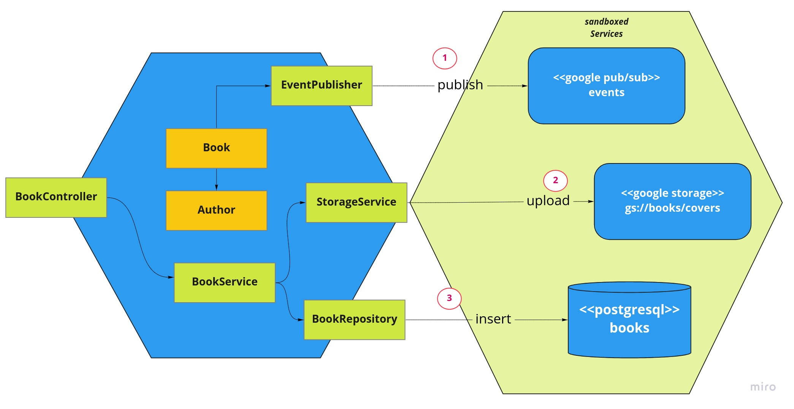
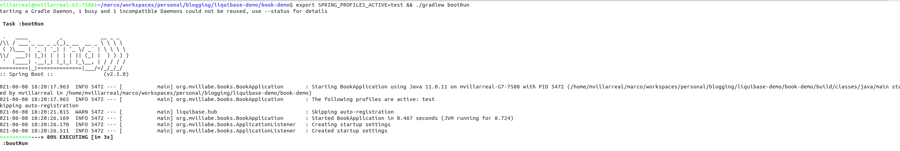
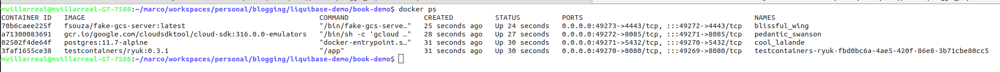

# E2E Sandbox with Test-containers

End to End tests can be cumbersome the mayority of the times, we need to wire up a lot of services(cache servers, database engines, message brokers etc) resulting in a big ball of stuff to do in order to run a simple test.

These tests are the most expensive ones in the [test pyramid](https://martinfowler.com/articles/practical-test-pyramid.html#:~:text=The%20%22Test%20Pyramid%22%20is%20a,put%20it%20into%20practice%20properly.), but are the ones closer to a real production scenario. 

While unit tests ensures our business logic is ok, e2e tests ensures that our platform will perform accordingly with no surprises.

In this article we are going to put hands up with testcontainers to create an e2e sandbox and run some **postman assertions** through **newman**.

# What is TestContainers?

Tescontainers is a java library to run containers in JUnit tests, it provides lightweight containers environment.

While the intended use of testcontainers is to run containers in the context of a Junit test, we will use it to create a sandbox environment outside junit environment.


# Tools Needed

The following tools are needed to run this example:

* Java (I am using openjdk 11.0.11 2021-04-20)
* Docker (I am using Docker version 20.10.7, build f0df350)
* Postman collection(Attached in the repo)
* Newman (I am using 5.2.3) + newman-html-reporter
* [This repo :D](https://github.com/mvillarrealb/liquibase-demo/tree/master/book-demo)

# Our Service

Our service it is a continuation of [my previous post on database migration](https://dev.to/mvillarrealb/database-migrations-for-micronaut-spring-with-liquibase-539a). TLDR; we are working on a really simple book registry api.

However as you can see there are several infraestructure services to provide a fully featured service:



The services we need to provide in the sandbox are:

1. **Google Pub/sub**: To publish Events regarding the Book registry

2. **Google Cloud Storage**: To upload book covers

3. **PostgreSQL**: To store books and author data.

---

# Creating The Spring Profile

To create the sadbox environment we will take advantage of the **spring profiles** and **conditional beans**, to achieve that, the following steps are required:


## Configure testcontainers dependencies

We will add testcontainers gcp module and of course testcontaiers for postgresql

```groovy
	implementation "org.testcontainers:gcloud:1.15.3"
	runtimeOnly 'org.testcontainers:postgresql'
```

## Create Profile application-test.yaml

Apart from our application-default.yaml, we will add an additional yaml file for our test profile

```
+--resources
|   +--db
|   +--application-default.yaml
|   +--application-test.yaml #Sandbox configuration file
```

The content of application-test.yaml looks like this:

```yaml
server:
  port: 8080
  profiles: test # Define the applied profile
logging:
  level:
    root: WARN
    org.springframework.web: WARN
    org.mvillabe.books: INFO
    org.hibernate: WARN
spring:
  liquibase:
    enabled: true
    change-log: "classpath:/db/changelog.yaml"
  datasource:
    url: "jdbc:tc:postgresql:11.7-alpine:///book_demo" #Testcontainers jdbc URI format
    driverClassName: "org.testcontainers.jdbc.ContainerDatabaseDriver" #Tescontainers jdbc driver to hook automatically
  cloud:
    gcp:
      project-id: "test-containers"
      credentials: # Dummy encoded key
        encoded-key: "${BASE64_ENCODED_DUMMY_SVC_ACCOUNT}"
      storage: 
        enabled: false # Disable default bean wiring for storage
      pubsub:
        emulator-host: "${EMULATOR_HOST:127.0.0.1:8085}"
```

## Configuring Sandbox beans

To configure the sandbox beans we will use the following class:

```java
@Profile("test") //This configuration bean will only be available on test profile
@Configuration
public class BeanConfiguration {
  /*Your bean definition*/
}
```

Each service configuration must be added to **BeanConfiguration** class:

### Configuring Postgresql

Automatically wired with testcontainers jdbcDriver(org.testcontainers.jdbc.ContainerDatabaseDriver) - Sweet!

### Configuring Cloud Storage

* Disable default spring cloud wiring with property **spring.cloud.gcp.storage.enabled = false** <- we did this in our application-test.yaml

* Define a **StorageEmulator** container:

```java
    @Bean
    public StorageEmulator storageEmulator() {
        StorageEmulator storageEmulator = new StorageEmulator();
        storageEmulator.start();
        return storageEmulator;
    }
```

* Manually register **Storage** Bean:

```java
    /**
    As you can see Storage bean uses as dependency the previously created StorageEmulator bean, this is because
    we need to wire up the emulator first and provide an endpoint for cloud storage to work it
    */
    @Bean
    @Primary
    public Storage storage(StorageEmulator emulator, GcpProjectIdProvider gcpProjectIdProvider) {
        return StorageOptions.newBuilder()
                .setProjectId(gcpProjectIdProvider.getProjectId())
                .setHost(emulator.getEmulatorEndpoint())
                .build()
                .getService();
    }

```

### Configuring Pub/Sub

* Define a **PubSubEmulatorContainer** container:

```java
    @Bean("pubSubEmulatorContainer")
    public PubSubEmulatorContainer pubSubEmulatorContainer() {
        PubSubEmulatorContainer container = new PubSubEmulatorContainer(
            DockerImageName.parse("gcr.io/google.com/cloudsdktool/cloud-sdk:316.0.0-emulators")
        );
        container.start();
        return container;
    }
```

* Override bean **GcpPubSubProperties** (Spring Cloud **AutoConfiguration** Bean) to reload **EMULATOR_HOST** environment variable with the emulator Host

```java
    /*
    * As we did with Storage, the Pubsub must be wired up with the emulator to provide the container host:port,
    * in this case we are overriding de auto congiguration bean initialized before PubSubTemplate
    */
    @Primary/*Override default bean*/
    @ConfigurationProperties("spring.cloud.gcp.pubsub")/*Load pubsub properties*/
    @Autowired
    @Bean
    public GcpPubSubProperties configurationProperties(PubSubEmulatorContainer pubSubEmulatorContainer) {
        System.setProperty("EMULATOR_HOST", pubSubEmulatorContainer.getEmulatorEndpoint());
        return new GcpPubSubProperties();
    }
```

With all these settings we are ready to run our application via command line or IntellijIdea(just consider adding an environment variable with: SPRING_PROFILES_ACTIVE=test )

# Running the application

Run your application with the following command:

```sh
export SPRING_PROFILES_ACTIVE=test && ./gradlew bootRun
```
If everything started ok, then you will see some basic logs:



If you check your docker containers you will notice some activity:



Each individual container represents your app services, test containers will also create an additional container representing your app.

# Testing with Postman/Newman

The whole purposse of all this configuration is to run our quality assurance team postman collection with newman, so let's do so:

```sh
newman run books-e2e.postman_collection.json -r html

#if you have a custom html reporter
newman run books-e2e.postman_collection.json -r html --reporter-html-template htmlreqres.hbs 

# To export test results in junit format(Good for CI/CD tools like Azure Devops)
newman run books-e2e.postman_collection.json -r junit
```

And that's it


# Caveats and Conclusions

* The idea of a sandbox environment is to run stuff as isolated and reproducible as posible to provide better feedback on how things work on the intended infraestructure.

* A sandbox is also nice for developers who does not want to have a lot of containers running all the time to test a microservice.

* If you are going to use a sandbox environment for your microservices architecture, consider isolating a dependency with the bean configuration boilerplate(of course adapted to your stack :D).

* **Why not use JUNIT instead**: As I said before, testcontainers was designed to run smoothly in junit environments, is it's natural behavior, however when we are working on a team with quality Assurance professionals, they are more familiar with tools like postman, newman, gatling etc. They are not interested on creating java code to assert basic e2e behavior.

* You may ask yourself, why bother creating a whole emulated infraestructure just for testing?, When you are working with microservices architecture we are supposed to be as decoupled as posible, but that does not mean that 

* Wiring up a successful sandbox can be difficult, and a little bit tricky, in my case I've found overriding some beans really challenging (you must know what you are touching and why, and of course ensure your production code doesn't get polluted by this beans/configurations).

As a bottom note I encourage you to play with testcontainers outside Junit with your own stack and discover what works for you.